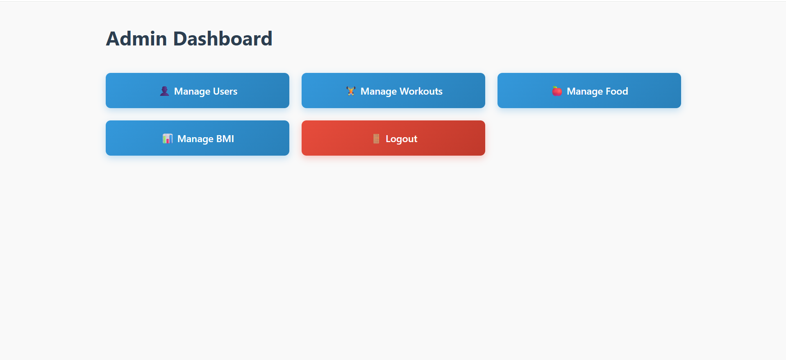

# PowerLog - Admin Dashboard

## Kuvakaappaukset sovelluksen käyttöliittymästä

  
  
  

## Linkit

- **Linkki julkaistuun sovellukseen (front-end)**: [https://linkki_julkaistuun_frontend_sovellukseen.com](https://linkki_julkaistuun_frontend_sovellukseen.com)
- **Linkki käytössä olevaan back-end-sovellukseen/APIin**: [https://linkki_backend_apiin.com](https://linkki_backend_apiin.com)
- **Linkki API-dokumentaatioon (apidoc)**: [apidoc](https://users.metropolia.fi/~jannepeh/powerlog/)

## Rautalankamallit

- **Linkki rautalankamalleihin**: [rautalankamallit](https://www.figma.com/design/ZYoS7TbFEcz43DUvRnnghK/PowerLog?node-id=0-1&p=f&t=ysxk2WxgWZGNx8sG-0) 

## Tietokannan kuvaus

Tässä on tietokannan rakenne ja kuvaus:

Tietokannan taulut:
- **Users**: Käyttäjätietojen säilytys (ID, nimi, sähköposti, salasana, käyttäjätaso)
- **Workouts**: Harjoitusmuotojen ja käyttäjän harjoitushistorian hallinta
- **WorkoutForms**: Harjoituslomakkeet
- **Food**: Käyttäjän ruokapäiväkirjat
- **BMI**: Kehon massan indeksi (BMI) - tietojen tallentaminen
- **FormsQuestions**: Kysymykset käyttäjäprofiilin täyttämiseksi
- **Form_Choices**: Kysymykset ja valinnat lomakkeella
- **User_Answers**: Käyttäjän vastaukset kysymyksiin
- **User_Profiles**: Käyttäjien profiilit ja tiedot

## Toiminnallisuudet

Sovellus sisältää seuraavat toiminnot:

1. **Rekisteröityminen ja kirjautuminen**:
   - Käyttäjät voivat luoda tilin ja kirjautua sisään.
   - Sähköposti ja salasana tarvitaan kirjautumiseen.

2. **Käyttäjien hallinta**:
   - Admin voi hallita käyttäjiä, muokata heidän tietojaan ja poistaa käyttäjiä.

3. **Harjoitusten hallinta**:
   - Käyttäjät voivat lisätä, muokata ja poistaa harjoituksia.
   - Admin voi hallita kaikkia harjoituksia.

4. **Ruokapäiväkirjan hallinta**:
   - Käyttäjät voivat lisätä ruokia ruokapäiväkirjaan.
   - Admin voi tarkastella kaikkia ruokapäiväkirjan merkintöjä.

5. **BMI-tiedot**:
   - Käyttäjät voivat tallentaa omia BMI-tietojaan.
   - Admin voi tarkastella käyttäjien BMI-tietoja.

6. **API-tuki**:
   - Sovellus tarjoaa RESTful API:n käyttäjätoimintojen ja tietojen hallintaan.
   - Dokumentaatio löytyy [API-dokumentaatiosta](https://linkki_apidoc.com).

7. **Calorie Tracker**:
   - Käyttäjät voivat seurata ruokailujaan ja saada kalorimäärän.
   - Ruokailuista ja niiden kaloreista ilmoitetaan backendissä.

## Mahdolliset tiedossa olevat bugit/ongelmat

- **Bugi 1**: Tietojen muokkaus ei aina tallenna oikein, jos yhteys katkeaa.
- **Bugi 2**: Joissain selaimissa käyttöliittymä ei skaalautu oikein.
- **Bugi 3**: Jos käyttäjä ei ole kirjautuneena, hän ei voi käyttää API:ta, mutta ei saa selkeää virheilmoitusta.

## Referenssit, käytetyt tutoriaalit, grafiikkakirjastot, tms.

- **React**: [https://reactjs.org](https://reactjs.org)
- **Node.js ja Express**: [https://expressjs.com](https://expressjs.com)
- **MySQL**: [https://www.mysql.com](https://www.mysql.com)
- **Axios**: [https://axios-http.com](https://axios-http.com)
- **bcryptjs**: [https://www.npmjs.com/package/bcryptjs](https://www.npmjs.com/package/bcryptjs)
- **JSON Web Tokens (JWT)**: [https://jwt.io](https://jwt.io)
- **Bootstrap**: [https://getbootstrap.com](https://getbootstrap.com)

## Linkki ohjelmistotestauskansioon, mistä löytyvät testitapaukset

- **Testitapaukset**: [https://linkki_testikansioon.com](https://github.com/Azzni96/powerlog/tree/testi/backend/src/tests)
(https://github.com/Azzni96/powerlog/tree/web-perust-2/.github/workflows)

## Varmistakaa, että opettajille on pääsy/käyttöoikeudet kaikkeen edellymainittuun materialiin

- **GitHub Repository**: [https://github.com/Azzni96/powerlog/tree/web-perust-2)
